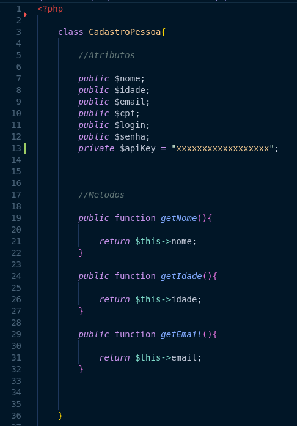
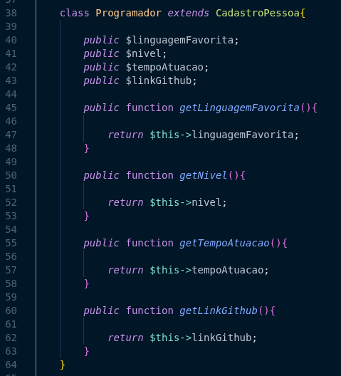
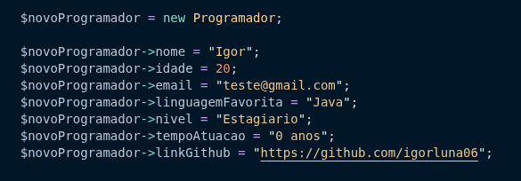
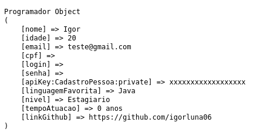
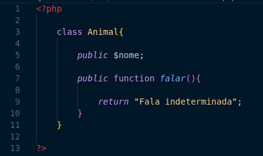
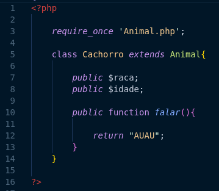
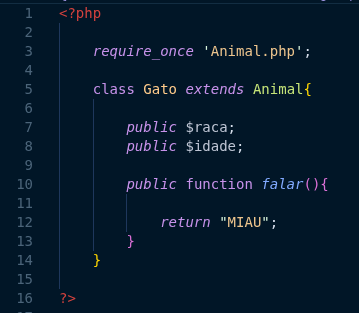
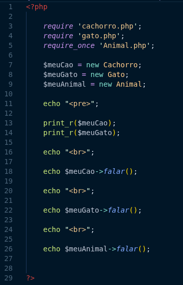

### POO (Programação Orientada a Objetos)

- A Programação Orientada a Objetos (POO) é um paradigma de programação que utiliza "objetos" para representar dados e funcionalidades. Em PHP, a POO permite organizar o código de maneira mais modular e reutilizável.

#### Conceitos Básicos da POO

1. **Classe**: Uma classe é um molde ou uma estrutura que define as propriedades (atributos) e comportamentos (métodos) de um objeto. É como um plano para criar objetos.

   ```php
   class Carro {
       public $cor;
       public $modelo;

       public function acelerar() {
           echo "O carro está acelerando!";
       }
   }
   ```

2. **Objeto**: Um objeto é uma instância de uma classe. Ele contém valores específicos para as propriedades definidas na classe.

   ```php
   $meuCarro = new Carro();
   $meuCarro->cor = "vermelho";
   $meuCarro->modelo = "Fusca";
   $meuCarro->acelerar(); // Saída: O carro está acelerando!
   ```

3. **Propriedades**: São as variáveis que pertencem a uma classe. Elas armazenam os dados do objeto.

    ```php
    class Pessoa {
         public $nome;
         public $idade;
    }
    ```

4. **Métodos**: São as funções que pertencem a uma classe. Eles definem os comportamentos do objeto.

    ```php
    class Pessoa {
        public $nome;
        public $idade;
        public function apresentar() {
            echo "Olá, meu nome é " . $this->nome . " e eu tenho " . $this->idade . " anos.";
        }
    }
    ```

5. **Herança**: A herança permite que uma classe (classe filha) herde propriedades e métodos de outra classe (classe pai). Isso promove a reutilização de código.

    ```php
    class Animal {
        public function fazerSom() {
            echo "Som genérico de animal";
        }
    }

    class Cachorro extends Animal {
        public function fazerSom() {
            echo "Latido";
        }
    }
    ```

6. **Encapsulamento**: O encapsulamento é o conceito de restringir o acesso direto a algumas propriedades e métodos de um objeto. Isso é feito usando modificadores de acesso como `public`, `protected` e `private`.

    ```php
    class ContaBancaria {
        private $saldo = 0;
        public function depositar($valor) {
            $this->saldo += $valor;
        }
        public function getSaldo() {
            return $this->saldo;
        }
    }
    ```

7. **Polimorfismo**: O polimorfismo permite que métodos com o mesmo nome se comportem de maneira diferente em classes diferentes. Isso é frequentemente usado em conjunto com a herança.

    ```php
    class Gato extends Animal {
        public function fazerSom() {
            echo "Miau";
        }
    }
    ```

#### Modificadores de Acesso

- **Public**: A propriedade ou método pode ser acessado de qualquer lugar.
- **Protected**: A propriedade ou método pode ser acessado apenas dentro da classe e por classes derivadas.
- **Private**: A propriedade ou método só pode ser acessado dentro da própria classe.


#### Vantagens da POO

- **Modularidade**: O código é organizado em classes e objetos, facilitando a manutenção e a compreensão.
- **Reutilização**: Classes podem ser reutilizadas em diferentes partes do programa ou em outros projetos
- **Facilidade de Manutenção**: Alterações em uma classe podem ser feitas sem afetar outras partes do código.
- **Abstração**: Permite focar nos aspectos essenciais de um objeto, ignorando detalhes desnecessários.

A POO é amplamente utilizada em PHP, especialmente em frameworks modernos como Laravel e Symfony, que aproveitam os conceitos de POO para criar aplicações robustas e escaláveis.

#### Exemplo

Classe Principal: 



Seus atributos :

- Nome, Idade, email, cpf, login, senha, apiKey.

Seus métodos:

- getNome, getIdade, getEmail.

----

Classe que herda da classe principal:



Seus atributos:

- linguagem, nivel, tempo de atuação, link do Github.

Seus métodos:

- getLinguagem, getNivel, getTempoAtuacao, getLinkGithub.

---

Criando um objeto e atribuindo valores ao objeto:



---

Exibindo o estado do objeto Programador com o método print_r:




Explicação do exemplo:

- Utilizando o metodo 'require' para incluir o arquivo da classe principal `Pessoa.php` e o arquivo da classe `Programador.php`.

- No exemplo acima, temos uma classe principal chamada `Pessoa` com atributos como nome, idade, email, cpf, login, senha e apiKey, além de métodos para obter o nome, idade e email.

- A classe `Programador` herda da classe `Pessoa` e adiciona seus próprios atributos, como linguagem, nível, tempo de atuação e link do GitHub, juntamente com métodos para obter esses valores.

- Criamos um objeto da classe `Programador` e atribuímos valores a seus atributos. Finalmente, usamos o método `print_r` para exibir o estado do objeto, mostrando todos os atributos e seus valores.


### Utilizando o 'require_once' para incluir arquivos de classes em um exemplo de polimorfismo:

Require_once : Serve para incluir um arquivo apenas uma vez, evitando erros de redefinição de classes ou funções.

Exemplo:

Classe Animal.php



Atributos:

- nome

Métodos:

- falar() : Exibe uma mensagem "Fala indeterminada".

Classe Cachorro.php



- Herda da classe Animal.

Atributos:

- raça, idade.

Métodos:

- falar() : Exibe a mensagem "AUAU".

Classe Gato.php



- Herda da classe Animal.

Atributos:

- raça, idade.

Métodos:

- falar() : Exibe a mensagem "MIAU".

Criando objetos no arquivo polimorfismo.php e utilizando seus metodos:



Explicação do exemplo:

- Utilizamos o `require_once` para incluir a classe 'Animal.php" nas classes 'Cachorro.php' e 'Gato.php', garantindo que a classe 'Animal' seja carregada apenas uma vez.

- As classes 'Cachorro' e 'Gato' herdam da classe 'Animal' e implementam o método 'falar()' de maneira diferente, demonstrando o conceito de polimorfismo.

- No arquivo 'polimorfismo.php', criamos objetos das classes 'Cachorro' e 'Gato' e chamamos o método 'falar()' em cada um deles, exibindo as mensagens específicas para cada animal.

- Isso ilustra como o mesmo método pode ter comportamentos diferentes dependendo do objeto que o invoca.

---

### Metodos Estáticos e Constantes em POO

- Métodos Estáticos: São métodos que pertencem à classe em si, e não a uma instância específica da classe. Eles podem ser chamados sem a necessidade de criar um objeto da classe. Em PHP, os métodos estáticos são definidos usando a palavra-chave `static`.

  Exemplo:

  ```php
  class Matematica {
      public static function somar($a, $b) {
          return $a + $b;
      }
  }

  // Chamando o método estático sem criar um objeto
  echo Matematica::somar(5, 10); // Saída: 15
  ```

- Constantes: São valores fixos que não podem ser alterados durante a execução do programa. Em POO, as constantes são definidas dentro de uma classe usando a palavra-chave `const`. Elas são acessadas usando o operador de resolução de escopo `::`.

    Exemplo:
    
    ```php
    class Circulo {
        const PI = 3.14159;
    
        public static function calcularArea($raio) {
            return self::PI * $raio * $raio;
        }
    }
    
    // Acessando a constante e chamando o método estático
    echo Circulo::PI; // Saída: 3.14159
    echo Circulo::calcularArea(5); // Saída: 78.53975
    ```

- Uso combinado: Métodos estáticos e constantes podem ser usados juntos para criar funcionalidades úteis dentro de uma classe, como demonstrado nos exemplos acima.

Diferença entre métodos estáticos e métodos de instância:

| Característica          | Método Estático                     | Método de Instância                |
|------------------------|------------------------------------|-----------------------------------|
| Associação             | Pertence à classe                   | Pertence a uma instância da classe|
| Chamada                | Pode ser chamado sem criar um objeto| Requer a criação de um objeto      |
| Acesso a propriedades  | Acessa propriedades estáticas ou constantes | Acessa propriedades da instância |


---

### Interfaces em POO

- Interface: Em POO, uma interface é um contrato que define um conjunto de métodos que uma classe deve implementar. As interfaces não contêm implementação de métodos; elas apenas declaram os métodos que devem ser implementados pelas classes que as utilizam.

Exemplo de Interface:

```php
interface Veiculo {
    public function acelerar($velocidade);
    public function frear($velocidade);
}
```

Implementação da Interface em uma Classe:

```php
class Carro implements Veiculo {
    public function acelerar($velocidade) {
        echo "O carro está acelerando a " . $velocidade . " km/h.";
    }   
    public function frear($velocidade) {
        echo "O carro está freando a " . $velocidade . " km/h.";
    }
}
```

Uso da Classe que Implementa a Interface:

```php
$meuCarro = new Carro();
$meuCarro->acelerar(100); // Saída: O carro está
$meuCarro->frear(50);    // Saída: O carro está freando a 50 km/h.
```

- Vantagens das Interfaces:
  - Promovem a consistência: Garantem que todas as classes que implementam a interface tenham os mesmos métodos.
  - Facilitam a manutenção: Mudanças na interface podem ser propagadas para todas as classes que a implementam.
  - Suportam o polimorfismo: Permitem que diferentes classes sejam tratadas de maneira uniforme se implementarem a mesma interface.

- É utilizado o termo "implements" para indicar que uma classe está implementando uma interface.

- As interfaces são especialmente úteis em sistemas grandes e complexos, onde diferentes partes do código precisam interagir de maneira previsível e consistente.


