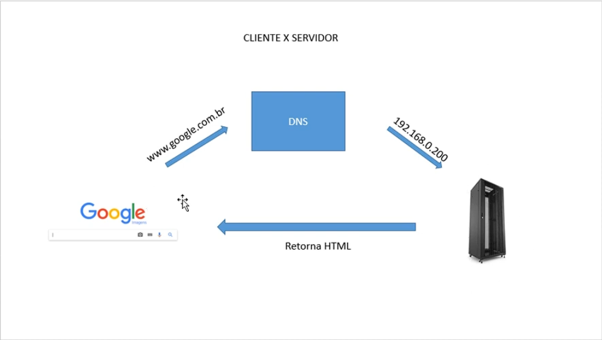

### Cliente X Servidor

- Cliente: É o dispositivo ou software que solicita serviços ou recursos de outro dispositivo ou software, conhecido como servidor. Exemplos comuns de clientes incluem navegadores web, aplicativos de e-mail e aplicativos móveis.

- Servidor: É o dispositivo ou software que fornece serviços ou recursos para os clientes. Ele processa as solicitações dos clientes e retorna os dados ou serviços solicitados. Exemplos comuns de servidores incluem servidores web, servidores de banco de dados e servidores de e-mail.

- Comunicação Cliente-Servidor: A comunicação entre cliente e servidor geralmente ocorre através de uma rede, como a internet. O cliente envia uma solicitação ao servidor, que processa a solicitação e envia uma resposta de volta ao cliente.

- Protocolos: A comunicação entre cliente e servidor é regida por protocolos, que são conjuntos de regras que definem como os dados são transmitidos. Exemplos de protocolos comuns incluem HTTP/HTTPS para web, FTP para transferência de arquivos e SMTP para e-mail.

- Arquitetura: A arquitetura cliente-servidor pode ser dividida em várias camadas, onde o cliente lida com a interface do usuário e o servidor lida com a lógica de negócios e o armazenamento de dados. Isso permite uma separação clara de responsabilidades e facilita a manutenção e escalabilidade do sistema.

- Exemplos Práticos: Um exemplo clássico de arquitetura cliente-servidor é um site. O navegador (cliente) solicita uma página web do servidor, que processa a solicitação, recupera os dados necessários e envia a página de volta ao navegador para exibição ao usuário.

### Servidor DNS

- Servidor DNS (Domain Name System): É um servidor que traduz nomes de domínio legíveis por humanos (como www.exemplo.com) em endereços IP numéricos (como 192.168.1.1).

- Funcionamento: Quando um usuário digita um nome de domínio em seu navegador, o cliente DNS do dispositivo envia uma consulta para o servidor DNS. O servidor DNS responde com o endereço IP correspondente ao nome de domínio solicitado.

- Importância: O servidor DNS é crucial para a navegação na internet, pois permite que os usuários acessem sites usando nomes fáceis de lembrar, em vez de ter que memorizar endereços IP complexos.

- Tipos de Servidores DNS: Existem vários tipos de servidores DNS, incluindo servidores raiz, servidores TLD (Top-Level Domain) e servidores autoritativos. Cada tipo desempenha um papel específico na resolução de nomes de domínio.

- Segurança: Servidores DNS também podem ser alvos de ataques, como ataques de envenenamento de cache DNS. Medidas de segurança, como DNSSEC (Domain Name System Security Extensions), são implementadas para proteger a integridade das respostas DNS.

- Exemplos Práticos: Quando você acessa um site como www.google.com, seu dispositivo consulta um servidor DNS para obter o endereço IP do servidor web do Google, permitindo que seu navegador se conecte ao site corretamente.

### Exemplo de Cliente X Servidor DNS

1. O usuário digita "www.exemplo.com" em seu navegador (cliente).

2. O navegador envia uma consulta DNS para o servidor DNS configurado no dispositivo do usuário.

3. O servidor DNS verifica seu cache ou consulta outros servidores DNS para encontrar o endereço IP correspondente a "www.exemplo.com".

4. O servidor DNS responde ao navegador com o endereço IP, por exemplo, "192.168.1.1".

### Conceito de virtual host

- Virtual Host: É uma técnica usada em servidores web para hospedar múltiplos sites (domínios) em um único servidor físico ou endereço IP. Cada site pode ter seu próprio nome de domínio, conteúdo e configurações, mesmo que compartilhem o mesmo servidor.

- Funcionamento: O servidor web é configurado para reconhecer diferentes nomes de domínio e direcionar as solicitações para o conteúdo apropriado com base no nome do host solicitado pelo cliente.

- Tipos de Virtual Hosts: Existem dois tipos principais de virtual hosts: baseados em nome (name-based) e baseados em IP (IP-based). Virtual hosts baseados em nome permitem que múltiplos domínios compartilhem o mesmo endereço IP, enquanto virtual hosts baseados em IP requerem endereços IP distintos para cada domínio.

- Configuração: A configuração de virtual hosts geralmente é feita em arquivos de configuração do servidor web, como o arquivo httpd.conf do Apache ou o arquivo nginx.conf do Nginx.

- Benefícios: O uso de virtual hosts permite uma melhor utilização dos recursos do servidor, facilita a gestão de múltiplos sites e reduz custos, já que não é necessário um servidor físico separado para cada site.

- Exemplo com php: Em um ambiente de desenvolvimento PHP, você pode configurar virtual hosts para testar diferentes projetos localmente, cada um com seu próprio domínio, como "projeto1.local" e "projeto2.local", apontando para diferentes diretórios no servidor web.

### XAMPP

- XAMPP: É um pacote de software livre que fornece um ambiente de servidor web local, incluindo Apache (servidor web), MySQL/MariaDB (banco de dados), PHP (linguagem de programação) e Perl. O nome XAMPP é um acrônimo para "Cross-Platform (X), Apache (A), MySQL (M), PHP (P) e Perl (P)".

- Propósito: O XAMPP é amplamente utilizado por desenvolvedores para criar e testar aplicações web localmente antes de implantá-las em um servidor de produção.

- Instalação: O XAMPP é fácil de instalar e configurar, tornando-o uma escolha popular para iniciantes e desenvolvedores experientes. Ele está disponível para Windows, Linux e macOS.

- Componentes: O XAMPP inclui vários componentes essenciais para o desenvolvimento web, como o Apache para servir páginas web, MySQL/MariaDB para gerenciamento de banco de dados, PHP para programação do lado do servidor e phpMyAdmin para administração de bancos de dados via interface web.

- Uso: Após a instalação, os desenvolvedores podem iniciar o servidor Apache e o banco de dados MySQL/MariaDB através do painel de controle do XAMPP, permitindo que eles testem suas aplicações web localmente.

- Segurança: O XAMPP é projetado para ser usado em ambientes de desenvolvimento e não é recomendado para uso em produção sem as devidas configurações de segurança, como a alteração das senhas padrão e a desativação de serviços desnecessários.

## projeto PHP com XAMPP e Virtual Hosts 

- Name : MeuSite

- Local : /opt/lampp/htdocs/meusite

